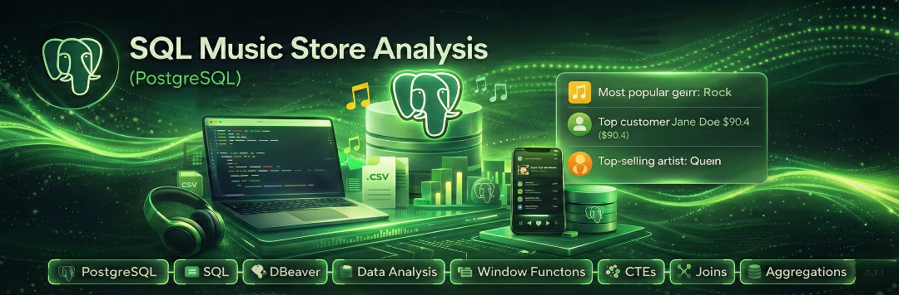

# 🎵 SQL Music Store Analysis (PostgreSQL)


**Tech stack:** PostgreSQL · SQL · DBeaver · CSV · Window Functions · CTEs · Git  

## 📌 Project Overview
This project performs SQL-driven exploratory analysis on a digital music store dataset using **PostgreSQL**. The analysis covers customers, artists, albums, tracks, and sales transactions, and focuses on answering real-world business questions using joins, aggregations, window functions, and common table expressions (CTEs).

All queries were written and executed using **PostgreSQL**, with **DBeaver** used as the primary database management and query execution tool.

The repository is designed to be **fully reproducible**—anyone can clone the repo, recreate the database, and run the analysis queries locally in PostgreSQL.

--- 

## 📁 Repository Structure

```
SQL-MUSIC-STORE-ANALYSIS-PROJECT/
│
├── Analysis/
│   ├── Analysis.sql
│   └── Analysis.txt
│
├── Datasets/
│   ├── album.csv
│   ├── artist.csv
│   ├── customer.csv
│   ├── employee.csv
│   ├── genre.csv
│   ├── invoice.csv
│   ├── invoice_line.csv
│   ├── media_type.csv
│   ├── playlist.csv
│   ├── playlist_track.csv
│   └── track.csv
│
├── Docs/
│   ├── INSIGHTS.md
│   ├── Music Store Analysis-Questions.pdf
│   └── SQL Music Store Analysis.pptx
│
├── Schema/
│   └── music_database_full.sql
│
├── README.md
└── schema_diagram.png
```

## 🗂️ Database Schema

The following diagram represents the relational schema used in this project.  
It illustrates the core entities (customers, invoices, tracks, artists, genres) and their relationships, forming the foundation for all analytical queries.


---


## 📦 What’s Included

- **`music_database_full.sql`** — full PostgreSQL schema + data dump  
- **`Datasets/`** — per-table CSV extracts of the raw data  
- **`Analysis.sql`** — analytical SQL queries (Q1–Q12)  
- **`Analysis.txt`** — plain-text version of analysis queries with comments  
- **`README.md`** — project documentation  
- **`schema_diagram.png`** — ER diagram of the database schema

### Presentation & Insights

- The project's key insights and business findings are documented in [Docs/Insights.md](Docs/Insights.md).
- Presentation (insights document): [Docs/Insights.md](Docs/Insights.md)
- Presentation (viewable PDF): [Docs/SQL_Music_Store_Analysis.pdf](Docs/SQL_Music_Store_Analysis.pdf)
- Presentation (editable PowerPoint): [Docs/SQL_Music_Store_Analysis.pptx](Docs/SQL_Music_Store_Analysis.pptx)
- Supplementary questions PDF: [Docs/Music_Store_Analysis_Questions.pdf](Docs/Music%20Store%20Analysis-Questions.pdf)

### Files in `Datasets/`

- `album.csv` — album metadata (album_id, title, artist_id)  
- `artist.csv` — artist metadata  
- `customer.csv` — customer profiles and billing information  
- `employee.csv` — store employees / support staff  
- `genre.csv` — music genres  
- `invoice.csv` — sales invoices and totals  
- `invoice_line.csv` — invoice line items (track purchases)  
- `media_type.csv` — media formats (MPEG, AAC, etc.)  
- `playlist.csv` — playlists  
- `playlist_track.csv` — playlist-to-track mappings  
- `track.csv` — track metadata (composer, duration, album)  

---

## 🎯 Project Goals

- Perform exploratory data analysis using **PostgreSQL**
- Demonstrate strong SQL skills, including:
  - Complex joins and subqueries  
  - Aggregations and grouping  
  - Window functions (`RANK`, `ROW_NUMBER`)  
  - Common Table Expressions (CTEs)
- Translate business questions into efficient SQL queries
- Build a clean, reproducible, **portfolio-ready SQL project**

---

## 🛠️ Prerequisites

- Git and basic command-line usage  
- **PostgreSQL** (tested with recent versions)  
- **DBeaver** (used as the primary database management and query tool)  

---

## ⚙️ Setup & Usage (PostgreSQL)

### Recreate the Database from SQL Dump (Recommended)

```bash
# Create database
createdb music_store

# Load schema and data
psql -d music_store -f music_database_full.sql

# Run analysis queries
psql -d music_store -f Analysis.sql
```
### Using DBeaver (Alternative)

Connect to your PostgreSQL server using DBeaver
Open music_database_full.sql and execute the script to recreate the database
Open Analysis.sql and run queries interactively

---
## 🧠 Business Questions Answered

The analysis in this project is structured into three levels of complexity **Easy, Moderate, and Advanced** to demonstrate progressive SQL skills, from basic aggregation to complex joins and window functions.

---

### 🔹 Question Set 1 — Easy

1. Identify the **senior-most employee** based on job title.  
2. Determine **which countries have the highest number of invoices**.  
3. Find the **top 3 invoices by total value**.  
4. Identify the **city with the highest total invoice revenue** to support decisions for hosting a promotional music festival.  
5. Determine the **best customer** based on total lifetime spending.

---

### 🔹 Question Set 2 — Moderate

6. Retrieve the **email, first name, last name, and genre** of all **Rock music listeners**, ordered alphabetically by email.  
7. Identify the **top 10 rock artists** based on the number of tracks written.  
8. List all **tracks longer than the average song length**, ordered by duration (longest first).

---

### 🔹 Question Set 3 — Advanced

9. Calculate **total spending by each customer on each artist**, returning customer name, artist name, and total amount spent.  
10. Determine **how much each customer spent on the single best-selling artist**.  
11. Identify the **most popular music genre by country**, based on total purchase amount, including **ties** where applicable.  
12. Determine the **top-spending customer per country**, returning all customers in cases where spending amounts are tied.

---

Each question is implemented using optimized SQL queries and demonstrates practical use of joins, aggregations, subqueries, common table expressions (CTEs), and window functions.

All queries are available in `Analysis.sql` and can be executed independently or as a complete script.

## Reproducing / Exporting Results

- Run `Analysis.sql` in your DB client to reproduce the results.
- To export a single query result to CSV in PostgreSQL: 

```sql
\copy (SELECT ...) TO 'output.csv' CSV HEADER 
```
---
## 📬 Contact

If you’d like to discuss this project or explore potential opportunities, feel free to connect with me:

- **Manohar K**
- **LinkedIn:** https://linkedin.com/in/your-profile  
- **GitHub:** https://github.com/your-username  
- **Email:** manoharmanu.k1999@gmail.com  

*Currently open to SQL and data analytics opportunities.*


---

## 🤝 Contributing

- Open an issue for bugs or feature requests
- Fork, create a branch, and submit a pull request (follow GitHub flow)

---